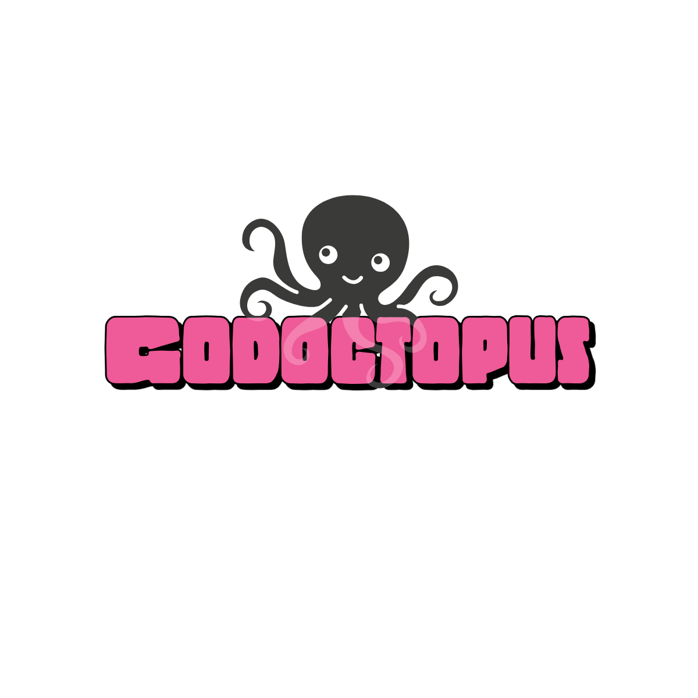

# 🐙 godoctopus

  


**Godoctopus** is an open-source library and CLI tool built in **Go (Golang)** that automatically generates **Markdown documentation** directly from your **source code**, powered by language models (LLMs).

> Let the octopus handle your docs — you focus on the code 🧠

---

## 🚀 Overview

**Godoctopus** scans your codebase, analyzes functions, structs, interfaces, and comments, and produces human-readable `.md` files describing what each piece of code does — including signatures, summaries, and explanations.

The goal is to **save developers time** by generating and maintaining up-to-date, AI-assisted technical documentation from real source code.

---

## 🧩 Features (MVP)

- 📚 Reads and parses Go source code (more languages in the future)  
- 🧠 Generates descriptive documentation using local or remote LLMs  
- 📝 Exports clean Markdown files (`.md`)  
- ⚙️ Simple CLI integration  
- 🧾 Organizes docs by package or module  

---

## 🧰 Example Usage

```bash
godoctopus ./internal/ --provider=openai
